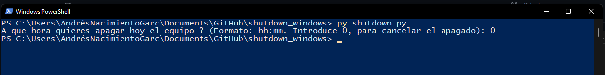

# Shutdown Windows
This project is a python script to shutdown Windows by introducing any hour in format hh:mm

# How to run

Run `py shutdown_windows.py` and type the hour `19:00` to shutdown your computer in that time.

# Example

# How to cancel 

Run `py shutdown_windows.py` and type `0` to abort the shutdown process.

# Example

